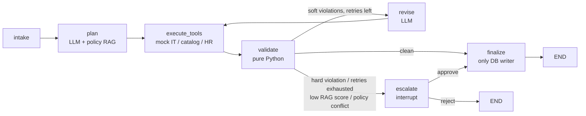

# AI HR Workflow Agent

An HR new-hire onboarding agent built with LangGraph. It takes an intake form and drafts an onboarding plan
(access, equipment, schedule, tasks) with an LLM. Deterministic Python validators then check the plan.
The agent revises it when it can and escalates to a human when it should. Nothing is written to the business
tables until the plan has been validated or a human has approved it.

## Problem

Companies onboard each new hire by hand across four systems: HR records, IT
access, equipment ordering and calendar/training. An HR coordinator spends a lot of time per hire, and
mistakes are found late.

## Solution overview



- **LLM:** Claude Haiku 4.5
- **Validators and routing:** Python
- **Storage:** SQLite (`data/onboard.db`), LangGraph `SqliteSaver` (`data/checkpoints.db`), ChromaDB policy index (`data/chroma/`).
- **Email and calendar:** they only write to the `outbox` and `calendar_events` tables.
- **Dashboard:** Streamlit with three pages: Cases, Audit Trace, Approval Queue.

## Demo

| Demo | Scenario | What it shows | Command |
|---|---|---|---|
| D1 | `scenario_01` | Clean happy path, auto-approved | `python scripts/run_case.py evals/scenarios/scenario_01.json` |
| D2 | `scenario_09` | Budget trap: the validator flags `BUDGET_EXCEEDED` and the plan is revised | `python scripts/run_case.py evals/scenarios/scenario_09.json` |
| D3 | `scenario_20` | Remote hire with a monitor request and conflicting policy sections, escalated | `python scripts/run_case.py evals/scenarios/scenario_20.json` |
| D4 | `scenario_16` | Privileged access (`aws_prod`), hard violation, escalated | `python scripts/run_case.py evals/scenarios/scenario_16.json` |
| D5 | `scenario_22` | Adobe licence pool exhausted, tool failure, revise | `python scripts/run_case.py evals/scenarios/scenario_22.json` |

An escalated case pauses at `interrupt()`. Resume it from the CLI or the dashboard:

```bash
python scripts/run_case.py --resume case-0016 --decision approve --comment "ok"
streamlit run dashboard/app.py      # Approval Queue page
```

The **Audit Trace** page shows every node, attempt, latency, token count, cost and payload, so you can
follow the self-correction in D2 step by step.

## Evaluation results

25 scenarios, escalations are auto-approved in eval mode so every run completes.

| Metric | Result | Target |
|---|---|---|
| Auto-approval precision | 89.5% (17/19) | >= 85% |
| Escalation recall | 100% (6/6) | - |
| Hard-case escalation recall | 100% (5/5) | 100% |
| Mean retries per case | 0.60 | - |
| Mean cost per case | EUR 0.0141 | - |
| Total eval cost | EUR 0.353 | - |

Two budget-trap scenarios (`scenario_09`, `scenario_12`) used up their retries and escalated instead of
auto-approving.

## Design decisions

- **Deterministic validators, not an LLM judge.** Policy checks must be reproducible and auditable, so the
  LLM only drafts the plan and Python decides whether it passes.
- **Database writes only in `finalize`.** Plans can be revised or rejected without leaving partial business
  data. `finalize` is idempotent.
- **Cheap model plus governance.** A small model is enough when every output is checked, retried at most
  `max_retries` times and escalated to a human on any hard violation.
- **Human-in-the-loop via `interrupt()`.** Resume with `Command(resume={"decision", "comment"})`. The
  checkpoint survives process restarts.

## Setup

Requires Python 3.10+ and an Anthropic API key. The first `init_all` run downloads a local embedding model.

```bash
python -m venv .venv
source .venv/bin/activate            # Windows: .venv\Scripts\activate
pip install -e ".[dev]"
cp .env.example .env                 # Windows: copy .env.example .env  -> set ANTHROPIC_API_KEY
python scripts/init_all.py           # idempotent: DB, seed data, policy index
python scripts/run_case.py evals/scenarios/scenario_01.json
```

Other commands:

```bash
pytest -q                                              # no network or API key needed
streamlit run dashboard/app.py
python evals/run_evals.py --auto-approve-escalations   # full 25-scenario evaluation (calls the API)
python evals/run_evals.py --only scenario_09,scenario_16
```

`TODAY_OVERRIDE` (default `2026-10-01` in the scripts) freezes the date used by the notice-period checks.

## Repository layout

```
config/        settings, policy tables, policy handbook
src/onboard_pilot/
  graph/       nodes, routing, graph assembly
  tools/       HR DB, equipment catalog, IT provisioner, scheduler, policy RAG
  validation/  deterministic validators and violation codes
  audit/       per-node audit logging
dashboard/     Streamlit app (3 pages)
evals/         25 scenarios, expected.yaml, run_evals.py
scripts/       init_all.py, run_case.py
tests/         unit tests
```
