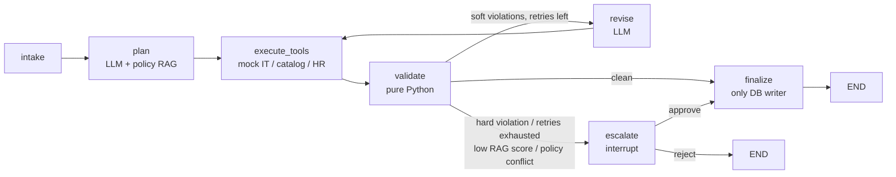

# AI HR Workflow Agent

An HR new-hire onboarding agent built with LangGraph. It takes an intake form, drafts an onboarding plan
(access, equipment, schedule, tasks) with an LLM, checks that plan with **deterministic Python validators**,
self-corrects when it can, and escalates to a human when it should. Nothing is written to the business
tables until the plan has been validated or a human has approved it.

## Problem

A mid-size company (500-2,000 FTE) onboards each new hire by hand across four systems: HR records, IT
access, equipment ordering and calendar/training. An HR coordinator spends roughly 45 minutes per hire, and
mistakes (over-budget equipment, access beyond role, missed compliance training) are found late.

## Solution overview



- **LLM:** Claude Haiku 4.5 (`claude-haiku-4-5-20251001`) through `langchain-anthropic`, `temperature=0`.
- **Validators and routing:** pure Python, never an LLM.
- **Storage:** SQLite (`data/onboard.db`), LangGraph `SqliteSaver` (`data/checkpoints.db`), ChromaDB policy index (`data/chroma/`).
- **Email and calendar are mocks:** they only write to the `outbox` and `calendar_events` tables.
- **Dashboard:** Streamlit with three pages: Cases, Case Trace, Approval Queue.

## Demo

A screen-recorded GIF is not included (see `DEVIATIONS.md`). Reproduce the five demo scenarios from the CLI:

| Demo | Scenario | What it shows | Command |
|---|---|---|---|
| D1 | `scenario_01` | Clean happy path, auto-approved | `python scripts/run_case.py evals/scenarios/scenario_01.json` |
| D2 | `scenario_09` | Budget trap, validator flags `BUDGET_EXCEEDED`, plan is revised | `python scripts/run_case.py evals/scenarios/scenario_09.json` |
| D3 | `scenario_20` | Remote hire with a monitor request, conflicting policy sections, escalated | `python scripts/run_case.py evals/scenarios/scenario_20.json` |
| D4 | `scenario_16` | Privileged access (`aws_prod`), hard violation, escalated | `python scripts/run_case.py evals/scenarios/scenario_16.json` |
| D5 | `scenario_22` | Adobe licence pool exhausted, tool failure, revise | `python scripts/run_case.py evals/scenarios/scenario_22.json` |

An escalated case pauses at `interrupt()`. Resume it from the CLI or the dashboard:

```bash
python scripts/run_case.py --resume case-0016 --decision approve --comment "ok"
streamlit run dashboard/app.py      # Approval Queue page
```

The **Case Trace** page shows every node, attempt, latency, token count, cost and payload, so the
self-correction in D2 is visible step by step.

## Hours saved

150 hires per year x 40 minutes saved per hire (45 minutes manual, about 5 minutes of review) = **about 100 hours per year**.
Mean LLM cost is about EUR 0.014 per case (see below), so the model spend is negligible against that.

## Evaluation results

25 scenarios, frozen date 2026-10-01, fresh databases per run (`python evals/run_evals.py`).
Escalations are auto-approved in eval mode so every run completes.

| Metric | Result | Target |
|---|---|---|
| Auto-approval precision | 89.5% (17/19) | >= 85% |
| Escalation recall | 100% (6/6) | - |
| Hard-case escalation recall | 100% (5/5) | 100% |
| Mean retries per case | 0.60 | - |
| Mean cost per case | EUR 0.0141 | - |
| Total eval cost | EUR 0.353 | - |

Two budget-trap scenarios (`scenario_09`, `scenario_12`) used up their retries and escalated instead of
auto-approving. Expectations were not edited to hide this. The full per-scenario table is in
`evals/report.md` and `evals/results.csv` after a run.

## Failure modes and mitigations

- **Prose-only rules (known gap, scenario 21).** The handbook says contractors never get `aws_dev`, but the
  rule is not in `config/policy_tables.yaml` or the validators, so it is auto-approved.
  *Mitigation:* move every enforceable rule from prose into the policy tables and add a validator.
- **Stale RAG.** The policy index is built from the handbook at init time. *Mitigation:* rebuild with
  `python scripts/init_all.py` whenever the handbook changes.
- **Over-escalation tuning.** The RAG confidence threshold (0.35) is not calibrated for the local embedding
  model, and a plan can run out of retries on tight budgets. *Mitigation:* tune the threshold and the
  revise prompt against the eval set.
- **Cost table drift.** `COST_TABLE` in `src/onboard_pilot/llm.py` uses assumed list prices and a fixed
  USD to EUR rate (1 USD = 0.92 EUR, 2026-10). Verify both before relying on the cost numbers.
- **Checkpoint deserialisation warnings.** LangGraph warns about unregistered schema types in checkpoints.
  This is harmless today; register the types with `allowed_msgpack_modules` before upgrading LangGraph.

## Design decisions

- **Deterministic validators, not an LLM judge.** Policy checks must be reproducible and auditable. The LLM
  proposes, Python disposes.
- **Database writes only in `finalize`.** Plans can be revised or rejected without leaving partial business
  data. The exceptions are listed in `DEVIATIONS.md` (P3). `finalize` is idempotent.
- **Cheap model plus governance.** A small model is enough when every output is checked, retried at most
  `max_retries` times and escalated to a human on any hard violation.
- **Human-in-the-loop via `interrupt()`.** Resume with `Command(resume={"decision", "comment"})`; the
  checkpoint survives process restarts.

## Setup

Requires Python 3.10+ and an Anthropic API key. The first `init_all` run downloads a local embedding model.

```bash
python -m venv .venv
source .venv/bin/activate            # Windows: .venv\Scripts\activate
pip install -e ".[dev]"
cp .env.example .env                 # Windows: copy .env.example .env  -> set ANTHROPIC_API_KEY
python scripts/init_all.py           # idempotent: DB, seed data, policy index
python scripts/run_case.py evals/scenarios/scenario_01.json
```

Other commands:

```bash
pytest -q                                              # no network or API key needed
streamlit run dashboard/app.py
python evals/run_evals.py --auto-approve-escalations   # full 25-scenario evaluation (calls the API)
python evals/run_evals.py --only scenario_09,scenario_16
```

`TODAY_OVERRIDE` (default `2026-10-01` in the scripts) freezes the date used by the notice-period checks.

## Repository layout

```
config/        settings, policy tables, policy handbook
src/onboard_pilot/
  graph/       nodes, routing, graph assembly
  tools/       HR DB, equipment catalog, IT provisioner, scheduler, policy RAG
  validation/  deterministic validators and violation codes
  audit/       per-node audit logging
dashboard/     Streamlit app (3 pages)
evals/         25 scenarios, expected.yaml, run_evals.py
scripts/       init_all.py, run_case.py
tests/         unit tests
```
